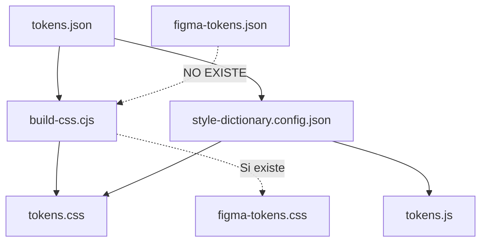

# 📊 Análisis Completo: Estructura de Tokens UBITS

## 🎯 Resumen Ejecutivo

Este documento proporciona un análisis exhaustivo de la estructura actual de tokens en el proyecto UBITS, incluyendo:
- Estructura de archivos y organización
- Sistema de generación de tokens
- Comparación entre tokens actuales y tokens de Figma
- Flujo de trabajo actual
- Plan de migración propuesto

---

## 📁 Estructura de Archivos

### Archivos en `packages/tokens/`

```
packages/tokens/
├── tokens.json                    # Tokens actuales UBITS (estructura plana)
├── figma-tokens.json              # ❌ NO EXISTE (referenciado en build-css.cjs)
├── style-dictionary.config.json    # Configuración Style Dictionary
├── build-css.cjs                  # Script de generación CSS
└── dist/
    ├── tokens.css                 # ✅ Tokens UBITS actuales (generado)
    ├── figma-tokens.css           # ✅ Tokens de Figma (2157 tokens)
    └── tokens.js                  # ✅ Tokens JS (generado por Style Dictionary)
```

---

## 📄 Análisis Detallado de Archivos

### 1. `tokens.json` - Tokens Actuales UBITS

**Estructura:**
```json
{
  "light": {
    "brand": { ... },
    "foreground": { ... },
    "background": { ... },
    "borders": { ... },
    "feedback": { ... },
    "sidebar": { ... },
    "chart": { ... },
    "button": { ... },
    "spacing": { ... },
    "borderRadius": { ... },
    // ... más categorías
  },
  "dark": {
    // ... misma estructura
  }
}
```

**Características:**
- ✅ Estructura plana por categorías temáticas
- ✅ Dos modos: `light` y `dark`
- ✅ Nomenclatura: `ubits-{categoria}-{nombre}-{modificador}`
- ✅ Modificadores como sufijos: `-inverted`, `-static`, `-static-inverted`
- ✅ Total: ~700+ tokens por modo

**Ejemplos de tokens:**
```css
--ubits-accent-brand: #0c5bef;
--ubits-fg-1-high: #303a47;
--ubits-bg-1: #ffffff;
--ubits-button-primary-bg-default: #0c5bef;
--ubits-spacing-xs: 4px;
--ubits-border-radius-md: 12px;
```

### 2. `figma-tokens.css` - Tokens de Figma

**Estructura:**
- ✅ **Total: 2157 tokens** (mucho más completo)
- ✅ Estructura jerárquica preservada
- ✅ Nomenclatura diferente: `--color-color-*`, `--modifiers-*`

**Ejemplos de tokens:**
```css
--color-color-accent-green: #050805;
--color-color-fg-1-high: #303a47;
--color-color-bg-1: #11183e;
--modifiers-inverted-color-light-accent-brand: #b6b5fc;
--modifiers-inverted-color-light-fg-1-high: #edeeef;
```

**Observaciones:**
- Los tokens de Figma tienen una estructura más jerárquica
- Usan prefijos como `color-color-*` y `modifiers-*`
- Incluyen más variantes y modificadores
- Tienen tokens para estados (default, hover, pressed)

### 3. `build-css.cjs` - Script de Generación

**Funcionalidad:**
1. **Genera `tokens.css`** desde `tokens.json`:
   - Aplana la estructura JSON
   - Genera variables CSS con prefijo `--ubits-*`
   - Soporta modos `light` y `dark`

2. **Genera `figma-tokens.css`** desde `figma-tokens.json` (si existe):
   - Extrae tokens preservando estructura
   - Busca propiedades `$cssVar` y `$value`
   - Genera variables CSS con estructura jerárquica

**Problema identificado:**
- ⚠️ `figma-tokens.json` no existe actualmente
- ⚠️ El script menciona ejecutar `scripts/convert-figma-to-css-vars.cjs` primero
- ⚠️ Pero `figma-tokens.css` ya existe (¿generado manualmente?)

### 4. `style-dictionary.config.json` - Configuración Style Dictionary

**Configuración actual:**
```json
{
  "source": ["packages/tokens/tokens.json"],
  "platforms": {
    "css": {
      "transformGroup": "css",
      "buildPath": "packages/tokens/dist/",
      "files": [
        { "destination": "tokens.css", "format": "css/variables" }
      ]
    },
    "js": {
      "transformGroup": "js",
      "buildPath": "packages/tokens/dist/",
      "files": [
        { "destination": "tokens.js", "format": "javascript/module" }
      ]
    }
  }
}
```

**Observaciones:**
- ✅ Solo procesa `tokens.json` (tokens actuales)
- ❌ No procesa tokens de Figma
- ✅ Genera CSS y JS automáticamente

---

## 🔄 Flujo de Trabajo Actual

### Generación de Tokens



### Uso en Componentes

1. **Componentes importan tokens:**
   ```css
   @import '../../tokens/dist/tokens.css';
   ```

2. **Componentes usan variables:**
   ```css
   .button {
     background: var(--ubits-button-primary-bg-default);
     color: var(--ubits-btn-primary-fg);
   }
   ```

3. **Sistema de add-ons permite intercambiar tokens:**
   ```typescript
   await window.UBITS.Tokens.applyFromSource({
     cssUrl: 'https://storybook.com/tokens.css'
   });
   ```

---

## 📊 Comparación: Tokens Actuales vs Figma

### Estructura

| Aspecto | Tokens Actuales | Tokens Figma |
|---------|----------------|--------------|
| **Organización** | Plana por categorías | Jerárquica |
| **Nomenclatura** | `ubits-{cat}-{name}` | `color-color-{name}` |
| **Modos** | `light`, `dark` | `light`, `dark` + modificadores |
| **Modificadores** | Sufijos (`-inverted`) | Estructura (`modifiers-inverted-*`) |
| **Estados** | Limitados | Completo (default, hover, pressed) |
| **Total tokens** | ~700 por modo | 2157 total |

### Ejemplos de Mapeo

#### Color de Acento
```css
/* Actual */
--ubits-accent-brand: #0c5bef;

/* Figma */
--color-color-accent-brand: #0c5bef;
--modifiers-inverted-color-light-accent-brand: #b6b5fc;
```

#### Foreground
```css
/* Actual */
--ubits-fg-1-high: #303a47;
--ubits-fg-1-high-inverted: #edeeef;

/* Figma */
--color-color-fg-1-high: #303a47;
--modifiers-inverted-color-light-fg-1-high: #edeeef;
```

#### Botones
```css
/* Actual */
--ubits-button-primary-bg-default: #0c5bef;
--ubits-button-primary-hover: #223a91;
--ubits-button-primary-pressed: #1e4abf;

/* Figma */
--color-button-primary-bg-default: #0c5bef;
--color-button-primary-bg-hover: #223a91;
--color-button-primary-bg-pressed: #1e4abf;
```

---

## ⚠️ Problemas Identificados

### 1. **Archivo `figma-tokens.json` Faltante**
- El script `build-css.cjs` espera `figma-tokens.json`
- El archivo no existe en el repositorio
- `figma-tokens.css` existe pero su origen es incierto

### 2. **Inconsistencia en Nomenclatura**
- Tokens actuales: `ubits-*`
- Tokens Figma: `color-color-*`, `modifiers-*`
- Dificulta la migración y el mapeo

### 3. **Estructura Diferente**
- Tokens actuales: plana con sufijos
- Tokens Figma: jerárquica con prefijos
- Requiere transformación para compatibilidad

### 4. **Falta de Integración**
- `figma-tokens.css` no está integrado en el flujo de build
- No se usa en componentes actuales
- Solo existe como referencia

### 5. **Modificadores Duplicados**
- Tokens actuales tienen muchos tokens con sufijos repetitivos
- Ejemplo: `ubits-accent-brand-static-inverted-static-inverted`
- Figma usa estructura más limpia con `modifiers-*`

---

## 🎯 Plan de Migración Propuesto

### Fase 1: Preparación y Análisis ✅
- [x] Analizar estructura actual de tokens
- [x] Analizar estructura de tokens Figma
- [x] Identificar discrepancias
- [x] Documentar mapeo de tokens

### Fase 2: Reestructuración JSON
- [ ] Crear/obtener `figma-tokens.json` desde Figma
- [ ] Reestructurar `tokens.json` para alinearse con Figma
- [ ] Mantener compatibilidad con tokens existentes
- [ ] Crear sistema de aliases para migración gradual

### Fase 3: Actualización de Generación CSS
- [ ] Actualizar `build-css.cjs` para nueva estructura
- [ ] Generar tokens con nomenclatura Figma
- [ ] Mantener generación de tokens legacy (`ubits-*`)
- [ ] Crear mapeo automático entre estructuras

### Fase 4: Actualización de Storybook
- [ ] Crear stories para tokens en Storybook
- [ ] Organizar tokens por categorías (Color, Spacing, Typography, etc.)
- [ ] Mostrar tokens en modo light y dark
- [ ] Incluir ejemplos de uso

### Fase 5: Migración de Componentes
- [ ] Crear script de migración automática
- [ ] Migrar componentes gradualmente
- [ ] Actualizar referencias de tokens
- [ ] Validar que todo funciona correctamente

---

## 🔧 Recomendaciones Técnicas

### 1. **Estructura JSON Propuesta**

```json
{
  "$schema": "https://schemas.figma.com/tokens/v1",
  "light": {
    "color": {
      "accent": {
        "brand": {
          "$type": "color",
          "$value": "#0c5bef",
          "$cssVar": "--color-color-accent-brand"
        }
      },
      "fg": {
        "1": {
          "high": {
            "$type": "color",
            "$value": "#303a47",
            "$cssVar": "--color-color-fg-1-high"
          }
        }
      }
    },
    "modifiers": {
      "inverted": {
        "color": {
          "light": {
            "accent": {
              "brand": {
                "$type": "color",
                "$value": "#b6b5fc",
                "$cssVar": "--modifiers-inverted-color-light-accent-brand"
              }
            }
          }
        }
      }
    }
  },
  "dark": {
    // ... misma estructura
  }
}
```

### 2. **Sistema de Aliases para Compatibilidad**

```json
{
  "aliases": {
    "ubits-accent-brand": {
      "$type": "color",
      "$value": "{color.color.accent.brand}"
    },
    "ubits-fg-1-high": {
      "$type": "color",
      "$value": "{color.color.fg.1.high}"
    }
  }
}
```

### 3. **Script de Migración Automática**

```javascript
// migrate-tokens.js
function migrateComponent(componentPath) {
  // Reemplazar tokens antiguos con nuevos
  // --ubits-accent-brand -> --color-color-accent-brand
  // Mantener compatibilidad con aliases
}
```

---

## 📝 Próximos Pasos

1. **Obtener/Recrear `figma-tokens.json`**
   - Exportar desde Figma Tokens Studio
   - O recrear desde `figma-tokens.css` existente

2. **Crear Nueva Estructura JSON**
   - Basada en estructura Figma
   - Con aliases para compatibilidad

3. **Actualizar Sistema de Generación**
   - Modificar `build-css.cjs`
   - Actualizar `style-dictionary.config.json`

4. **Reorganizar Storybook**
   - Crear stories para tokens
   - Organizar por categorías

5. **Crear Script de Migración**
   - Automatizar migración de componentes
   - Validar cambios

---

## 📚 Referencias

- [Figma Tokens Studio Documentation](https://docs.tokens.studio/)
- [Style Dictionary Documentation](https://amzn.github.io/style-dictionary/)
- [Design Tokens W3C Community Group](https://www.w3.org/community/design-tokens/)

---

**Última actualización:** 2024
**Autor:** Análisis automatizado de estructura UBITS
